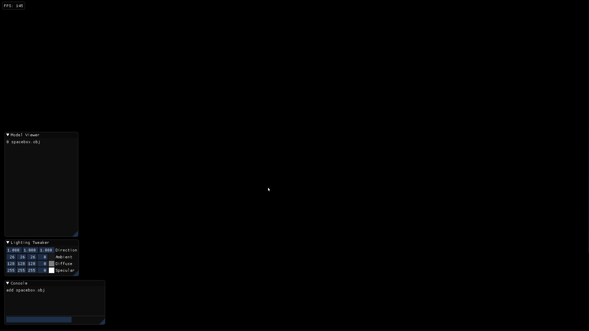
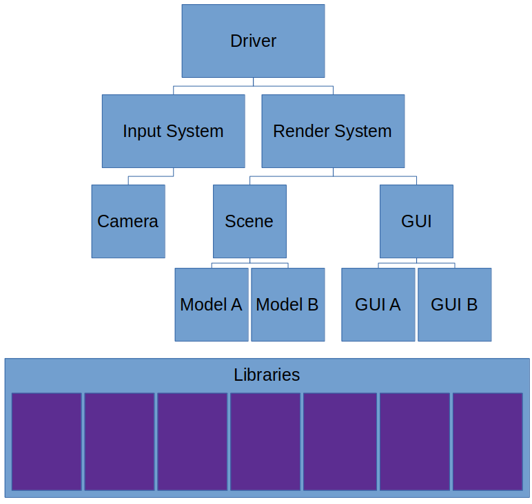

# Project-Koi (v4)
A 3D model renderer built using the Vulkan Graphics API. Project Koi will eventually be a fully-featured, cross-platform game engine.

## Demos

## Design
The renderer consists of a tree of systems, each with their own logic and resources. On each frame, the tree is traversed and each system in the tree is updated. Events are generated by the render systems and passed up and down the tree. The tree structure prevents events from traveling to all systems, only those that need to process the event.

## The Future of Project Koi
The current design (v4) is not ideal for world building. The inheritance based game object design of this iteration makes creating unique game objects a nightmare. The next iteration of Project Koi (v5) will use a composition based object model for game objects, a centralized memory manager to eliminate dynamic calls to malloc/free, and a job graph framework for describing scenes. Object components and scene graphs will we editable from the built in engine GUI.
